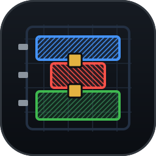

# mock-virtuoso

<br clear="left"/>


A test double that speaks the Cadence RAMIC bridge TCP protocol and
interprets a subset of Cadence SKILL, so `virtuoso-bridge-lite` can be
developed and tested without a real Cadence Virtuoso installation.

`mock-virtuoso` listens on a TCP port, accepts the same wire protocol the
real RAMIC bridge daemon (`ramic_bridge_daemon_3.py`) speaks, evaluates the
SKILL it receives against an in-memory design database (cellviews, shapes,
instances, windows, layer/purpose palette), and replies with the same
byte-level success/failure framing the real daemon uses.

## What this is not

This is not an EDA tool. It does not implement DRC, LVS, device physics,
parasitic extraction, simulation, or anything resembling real layout
verification. It implements just enough of SKILL's surface syntax and a
subset of the `db*`/`dd*`/`tech*`/`hi*`/`ge*`/`le*`/`pte*` function families
to let a bridge client create, read back, select, and delete layout
geometry and to exercise the protocol layer. Schematic functions (`sch*`)
and Maestro functions (`mae*`) are out of scope for this milestone; calling
them fails with `unknown function`, which is the same failure mode as
calling any other unimplemented function (see "Design" below).

## Install

```bash
uv venv .venv && source .venv/bin/activate
uv pip install -e ".[dev]"
```

`mock_virtuoso` itself has no dependency on `virtuoso_bridge` and never
will — see "Design" below. To run the contract test suite (the tests that
drive the real bridge client and builders against this mock), install
`virtuoso-bridge-lite` as an editable package into the same virtualenv.
This is a test-time-only, developer-machine install; it is intentionally
**not** declared in `pyproject.toml`:

```bash
uv pip install --python .venv/bin/python -e ../virtuoso-bridge-lite
```

## Usage

Start the server:

```bash
mock-virtuoso serve --port 65432
```

Point a `virtuoso-bridge-lite` client at it:

```python
from virtuoso_bridge import VirtuosoClient

client = VirtuosoClient.local(port=65432)
client.execute_skill("1+2")   # VirtuosoResult(status=SUCCESS, output='3')
```

`VirtuosoClient.local(port=...)` is also how the test suite drives the
mock: `MockVirtuosoServer` is used as a context manager bound to port `0`
(the OS picks a free port), and the client connects to `server.port`.

## Tests

```bash
pytest                            # unit tests (no bridge dependency)
uv pip install --python .venv/bin/python -e ../virtuoso-bridge-lite
pytest tests/contract             # contract tests (bridge required)
```

Everything under `tests/contract/` is the *only* place in this repository
allowed to import `virtuoso_bridge`. Those tests use
`pytest.importorskip("virtuoso_bridge")` so the suite still collects and
passes (by skipping) on a machine where the bridge isn't installed; install
it as shown above to actually exercise them.

The contract tests drive the real `virtuoso_bridge.VirtuosoClient` over a
real TCP socket against `MockVirtuosoServer`, using the bridge's own SKILL
builders (`virtuoso_bridge.virtuoso.layout.ops`) to generate the SKILL and
the bridge's own reader
(`virtuoso_bridge.virtuoso.layout.reader.parse_layout_geometry_output`) to
parse the results — the only test layer in this project that proves the
mock is useful for its actual purpose, rather than merely internally
consistent.

## Before committing

```bash
git config core.hooksPath .githooks
```

`.githooks/pre-commit` runs the suite and refuses a commit while it is red.
Three commits in one session went in with a failing test — each time the run
happened, printed `1 failed`, and was read as though it said passed. A machine
reads it correctly. `SKIP_TESTS=1` overrides it for the case where the red test
is the point.

## Design

See the design document at
[`../claudedocs/specs/2026-09-21-mock-virtuoso-design.md`](../claudedocs/specs/2026-09-21-mock-virtuoso-design.md).

One deliberate design rule worth calling out: an unsupported/unimplemented
SKILL function raises `unknown function: X` (surfaced to the client as a
NAK / `ExecutionStatus.ERROR`), rather than silently returning `nil`. A
real Virtuoso would do the latter for many unbound symbols in some
contexts, but a silent `nil` here would let missing mock coverage pass as
a false negative — a test asserting `nil` for the "not implemented" path
would keep passing forever, hiding the gap. Loud failure was chosen over
fidelity to that particular Virtuoso quirk.

## Demo

A runnable end-to-end demonstration lives in `demo/demo_layout_session.py`. It drives
`virtuoso-bridge-lite`'s own high-level Python API — `client.layout.edit()`,
`client.open_window()`, `client.get_current_design()`, `client.list_windows()`,
`client.fetch()`, `client.screenshot()` — against the mock. No line in it touches the
mock directly; every call is the same one you would make against a real Cadence Virtuoso.

```bash
uv pip install --python .venv/bin/python -e ../virtuoso-bridge-lite   # test-time only
.venv/bin/python demo/demo_layout_session.py
```

It builds a small layout (device rectangles, metal routing, a via, pin labels), places
two instances of it in a top cell, reads the result back through the bridge's own
`parse_layout_geometry_output`, batch-fetches attributes, writes a screenshot, and shows
out-of-scope SKILL (`mae*`, `sch*`) failing loudly rather than silently succeeding.

## Driving it with an agent

`virtuoso-bridge-lite` ships agent skills in its `skills/` directory. Because the bridge
already supports a **local mode** — tunnel state `mode: "local"` connects straight to
`127.0.0.1:<port>` with no SSH — the mock can sit exactly where a local Virtuoso would,
and the CLI, the Python API and those skills all work unmodified.

```bash
.venv/bin/python demo/agent_sandbox.py --port 65432     # mock + local-mode bridge state
.venv/bin/virtuoso-bridge status                        # [daemon] OK - connected to Virtuoso CIW
.venv/bin/virtuoso-bridge eval '1+2'                    # {"status": "success", "output": "3"}
```

Point an agent at `virtuoso-bridge-lite/skills/virtuoso/SKILL.md` and give it a design
task. One was asked to build a 2-input NAND standard cell and a three-wide row, told
only to follow the skill and to verify its work by reading the design back. It did,
and its output checks out through the CLI:

```
NAND2 bBox : ((-0.2 0.0) (4.2 4.2))   13 shapes
             NW×1  AA×2  PO×2 + labels A,B   M1×3 (VDD/VSS rails, Y strap) + labels Y,VDD,VSS
ROW        : I0 NAND2 R0 ((-0.2 0.0) (4.2 4.2))
             I1 NAND2 MY ((-0.2 0.0) (4.2 4.2))   <- mirrored, lands back on the same span
             I2 NAND2 R0 (( 7.8 0.0) (12.2 4.2))
```

`demo/agent_sandbox.py` removes the tunnel-state file on exit, so the bridge stops
believing a local Virtuoso is present once you stop the sandbox.

## The introduction panel

The floor carries an **ⓘ About / 소개** button opening a panel that says:
what the mock is, how a request reaches it, what this particular screen does,
what it deliberately does not do, and why it refuses rather than returning nil.

`toolkit/static/about.js` holds it, with a paragraph and a flow line per
screen — a table entry, so a second screen would cost an entry rather than a
rewrite. Korean and English sit side by side in one table
rather than in two files, so editing one language is visibly editing the other
— and a test fails if an entry ever carries only one. The choice is remembered
per browser and defaults to the browser's own language.

## The technology

Small and fixed, but real — the mock refuses anything outside it rather than
drawing something a technology could not produce.

| | |
|---|---|
| layers (purpose `drawing`) | `nwell` `diff` `poly` `met1` `met2` `met3` `text` |
| via definitions | `DIFF_M1` `PO_M1` `M1_M2` `M2_M3` |

`techGetTechFile(cv)` returns the technology, `techFindViaDefByName` answers
`nil` for a name it does not have, as Virtuoso does, and `dbCreateVia` refuses
anything that is not one of these — naming the ones that exist, so a refusal
tells you what would have worked.

## The front end

One screen: the **Agent Design Floor** at `http://127.0.0.1:8900`.

```bash
.venv/bin/python floor/design_floor.py
```

It is where you say what you want, where agents work, and where you watch both.
The request box takes a sentence — Korean or English — and runs it through the
same pipeline the OpenAI server exposes: plan, validate, build, read back. A
request builds through its own lane, so the SKILL it sends lands in the
transcript beside the agents', and the answer comes from the database rather
than from the plan.

The canvas is `toolkit/static/render.js`, the reader `toolkit/layout_reader.py`
and the pipeline `toolkit/planner.py` — all shared with `hermes/`, which is the
same capability with an OpenAI API instead of a screen.

An earlier build had a second front end, a hand-driven Layout Workbench. It was
retired: two screens meant two design databases and two of every helper, and
nothing it did could not be said in words to this one.

## Bridge token authentication

The daemon the bridge ships authenticates every request, and so does this mock.
`src/mock_virtuoso/auth.py` implements wire protocol v1 as
`ramic_bridge_daemon_3.py` defines it: a shared 0600 token file that never
crosses the wire, an HMAC over the *complete* request (so no field can be
swapped in flight), separate MAC domains for the capability handshake and for
execution, signed replies — error replies included, so a squatter on the port
cannot hide behind one — and server-side nonce replay rejection that fails
closed at capacity.

Both ends read the same file, `~/.virtuoso-bridge/bridge_token` by default
(`RB_TOKEN_PATH` for the daemon, `VB_BRIDGE_TOKEN` for the client), creating it
if absent. `MockVirtuosoServer` therefore authenticates by default, as the real
daemon does. The bundled entry points take a different route to the same place:
they hand the mock whatever token their client holds, so a bridge old enough to
predate token auth still gets the wire it expects without any version sniffing.

```python
server = MockVirtuosoServer(session)              # port bound, not yet serving
client = VirtuosoClient.local(port=server.port)
server.auth = Authenticator(getattr(client, "daemon_token", None))
server.start()
```

The contract suite runs whichever wire the installed bridge speaks, and one of
its tests asserts the two agree — a bridge with token auth must be exercising
the authenticated path, not quietly falling back to the legacy one.

## Agent design floor (`floor/`)

`floor/design_floor.py` puts several agents to work in **one** design database and
makes the process watchable:

```bash
.venv/bin/python floor/design_floor.py     # then open http://127.0.0.1:8900
```

One mock holds the design, the way one CIW session would. Each agent gets a *lane* —
a recording proxy standing where the daemon's port would be — and drives it with the
shipped CLI, unmodified:

```bash
virtuoso-bridge eval --env floor/lanes.env -p cells '<SKILL>'
```

`lanes.env` is generated at startup and simply points each bridge profile at its
lane's port (`VB_REMOTE_HOST_<lane>=localhost`), so the CLI resolves local mode
exactly as it would against a local Virtuoso. Nothing about the agent's tooling is
special-cased for the mock.

Five lanes ship: `cells` and `analog` draw leaf cells, `power` straps the row on
met3, `top` floorplans and places instances, and `verify` draws nothing — it
reads the finished design back and checks the other agents' claims against it.

Each session leaves a knowledge base behind. `floor/harvest.py` reads the
transcript, groups the failures, and matches them against the cases in
`skills/design-floor/kb/` — what it cannot match is what nobody has written
down yet. A case records what was tried, what came back and why, then names the
rule it produced and where that rule now lives, and a test checks the rule is
really there. A lesson cannot quietly fall out of a skill while a case goes on
claiming it.

The first ten cases came from one five-lane session: 112 calls, 27 failures, 11
distinct. The largest single group — 11 of the 27 — was one bad error message in
the mock, which had also produced two confidently wrong conclusions about the
tool in agents' reports. Three cases record successes, including the one where
an agent refused to size a power grid against a cell that was still empty.

Each lane's brief is a file rather than a prompt. `skills/design-floor/SKILL.md`
holds what every agent on the floor needs — how to reach the session, the
technology, the house rules — and `roles/<lane>.md` holds that lane's job. An
agent is dispatched by being told its lane and pointed at those two files. A
test pairs the lanes against the briefs, so adding one without the other fails
rather than leaving an agent with nothing to read.

The observatory at `:8900` shows three things side by side: which agent is doing
what, the full SKILL transcript with every reply, and the layout redrawn from the
database as it grows. Recording happens **on the wire**, not inside the mock —
`mock_virtuoso` is imported only to start the daemon — so the transcript is exactly
what a real Virtuoso would have received. The observatory reads the database
through its own direct connection, which keeps its polling out of the agents'
transcript.

## Natural-language API (`hermes/`)

`hermes/virtuoso_api_server.py` is an **OpenAI-compatible** server that turns a plain
request into a real layout:

```bash
.venv/bin/python hermes/virtuoso_api_server.py --port 8750
curl http://127.0.0.1:8750/v1/chat/completions -H 'Content-Type: application/json' -d '{
  "model":"virtuoso-fde",
  "messages":[{"role":"user","content":"STDLIB에 NAND2 셀을 정의하고 ROW에 4개 배치해줘"}]}'
```

Pipeline: request → planner → **validation** → `virtuoso-bridge-lite` builders → mock →
read back → answer.

The planner is pluggable. `--planner hermes` asks a hermes-agent OpenAI server for a JSON
plan (that model does not do OpenAI tool-calling, so it plans in JSON and this server
executes); `--planner rules` is a deterministic parser that needs no LLM at all;
`auto` prefers hermes and falls back.

**Point it at a server of its own.** The planner used to hardcode one port, so a server
on any other port was invisible and every request fell silently to the rules planner.
Two variables now pin the endpoint and the model — configuration beating discovery:

```bash
VB_PLANNER_URL=http://127.0.0.1:8644 VB_PLANNER_MODEL=mi-report \
  .venv/bin/python floor/design_floor.py
```

Unset, the planner probes the ports it knows, asks each one's `/v1/models` which models
it actually serves, and uses the first that answers — so an unconfigured checkout still
works, and a request that finds nothing says so instead of pretending.

Two properties worth stating plainly:

**The model's output is never executed.** Every plan passes a strict validator first —
op whitelist, layer whitelist, numeric coordinates with bounds, identifier-only cell and
instance names, a plan-size cap. Injection attempts like a cell named
`C") dbDeleteObject(cv) ("` or a coordinate of `0; dbDeleteObject(cv)` are rejected
before anything reaches the bridge, and a validated op with no builder raises rather than
being skipped.

**The answer is grounded in the database, not the plan.** After executing, the server
reads the design back through the bridge's own reader and reports the actual per-layer
counts, bounding boxes and instance transforms. If a plan instantiates a cell it never
defined, the reply says so instead of returning an empty box.

## Known upstream issues

While building the contract tests (Task 12), we found that
`virtuoso_bridge.virtuoso.layout.ops.layout_read_summary` emits SKILL whose
`return(buf)` sits **inside** the body of `foreach(inst cv~>instances ...)`
instead of after the loop:

```
foreach(inst cv~>instances buf = strcat(...) return(buf)))
```

In SKILL, `return()` unwinds the enclosing `prog`, so this has two
consequences, both reproduced against the mock and pinned by
`tests/contract/test_layout_contract.py`:

- **Zero instances**: the `foreach` body never runs, so `return` never
  executes, and the whole function evaluates to `nil` instead of the
  expected summary string.
- **One or more instances**: the function returns after the *first*
  `foreach` iteration. The header line correctly reports the true instance
  count (e.g. `3 instances`), but the body lists only the first instance.

`layout_read_geometry` does not have this bug — it builds its output
string outside the loop and lists every shape/instance.

`mock-virtuoso` faithfully executes the SKILL it is given, including this
bug; that is the mock behaving correctly, not a defect in the mock. The
fix belongs in `virtuoso-bridge-lite` (a separate repository) and is out
of scope here — `mock-virtuoso` must not special-case around it. If
`layout_read_summary` is fixed upstream, the two contract tests
(`test_read_summary_upstream_bug_zero_instances_yields_nil` and
`test_read_summary_upstream_bug_truncates_after_first_instance`) will fail
and must be flipped to match the corrected behavior.
