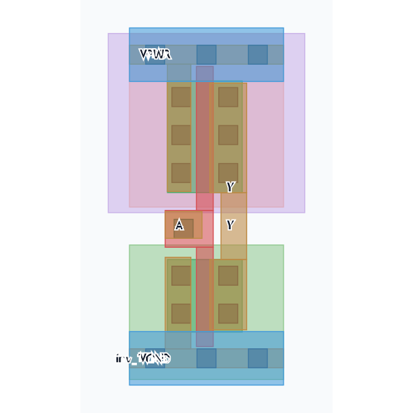
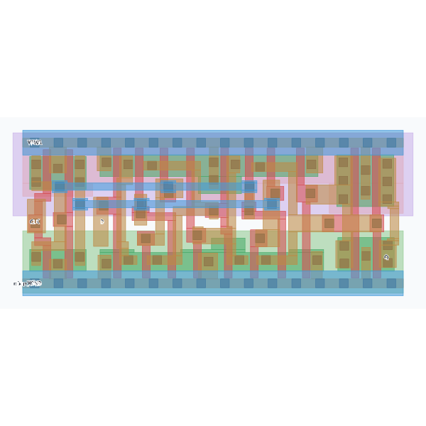

# SKY130 standard-cell layouts

These are the 12 real layouts loaded into `SKY130_EXAMPLES` in this project.
The GDS and reference SPICE are **unchanged public SkyWater library assets**,
not newly designed or independently sign-off-qualified cells.
SVG previews are generated here from the GDS polygons and pin labels.

Source: [google/skywater-pdk-libs-sky130_fd_sc_hd](https://github.com/google/skywater-pdk-libs-sky130_fd_sc_hd)
at commit `ac7fb61f06e6470b94e8afdf7c25268f62fbd7b1`. See [LICENSE](LICENSE) (Apache-2.0)
and [sources.json](sources.json) for per-file URLs and SHA-256 hashes.
Original copyright notices are retained in the SPICE files.

| Drawing cell | GDS / native top cell | Reference | View |
|---|---|---|---|
| INV_X1 | [sky130_fd_sc_hd__inv_1](sky130_fd_sc_hd__inv_1.gds) | [SPICE](sky130_fd_sc_hd__inv_1.spice) | [Preview](INV_X1.svg) |
| BUF_X1 | [sky130_fd_sc_hd__buf_1](sky130_fd_sc_hd__buf_1.gds) | [SPICE](sky130_fd_sc_hd__buf_1.spice) | [Preview](BUF_X1.svg) |
| NAND2_X1 | [sky130_fd_sc_hd__nand2_1](sky130_fd_sc_hd__nand2_1.gds) | [SPICE](sky130_fd_sc_hd__nand2_1.spice) | [Preview](NAND2_X1.svg) |
| NOR2_X1 | [sky130_fd_sc_hd__nor2_1](sky130_fd_sc_hd__nor2_1.gds) | [SPICE](sky130_fd_sc_hd__nor2_1.spice) | [Preview](NOR2_X1.svg) |
| AND2_X1 | [sky130_fd_sc_hd__and2_1](sky130_fd_sc_hd__and2_1.gds) | [SPICE](sky130_fd_sc_hd__and2_1.spice) | [Preview](AND2_X1.svg) |
| OR2_X1 | [sky130_fd_sc_hd__or2_1](sky130_fd_sc_hd__or2_1.gds) | [SPICE](sky130_fd_sc_hd__or2_1.spice) | [Preview](OR2_X1.svg) |
| XOR2_X1 | [sky130_fd_sc_hd__xor2_1](sky130_fd_sc_hd__xor2_1.gds) | [SPICE](sky130_fd_sc_hd__xor2_1.spice) | [Preview](XOR2_X1.svg) |
| XNOR2_X1 | [sky130_fd_sc_hd__xnor2_1](sky130_fd_sc_hd__xnor2_1.gds) | [SPICE](sky130_fd_sc_hd__xnor2_1.spice) | [Preview](XNOR2_X1.svg) |
| MUX2_X1 | [sky130_fd_sc_hd__mux2_1](sky130_fd_sc_hd__mux2_1.gds) | [SPICE](sky130_fd_sc_hd__mux2_1.spice) | [Preview](MUX2_X1.svg) |
| AOI21_X1 | [sky130_fd_sc_hd__a21oi_1](sky130_fd_sc_hd__a21oi_1.gds) | [SPICE](sky130_fd_sc_hd__a21oi_1.spice) | [Preview](AOI21_X1.svg) |
| OAI21_X1 | [sky130_fd_sc_hd__o21ai_1](sky130_fd_sc_hd__o21ai_1.gds) | [SPICE](sky130_fd_sc_hd__o21ai_1.spice) | [Preview](OAI21_X1.svg) |
| DFF_X1 | [sky130_fd_sc_hd__dfxtp_1](sky130_fd_sc_hd__dfxtp_1.gds) | [SPICE](sky130_fd_sc_hd__dfxtp_1.spice) | [Preview](DFF_X1.svg) |




Open a GDS in KLayout to inspect all layers. SVG colors are illustrative;
they are not a rule check or electrical-connectivity proof.
The Design Floor loads these bundled files at startup when KLayout's Python
package is installed. Existing cells are preserved. No download is required.

For DRC/LVS, upload the matching GDS and SPICE, use the exact native top-cell
name above, `VNB` as substrate net, and SKY130 micron dimensions.
Run the installed rule decks to establish the result for your chosen scope.
Simulation editor examples are separate educational circuits, so this package
does not assert that their transistor sizing matches these layouts.

Regenerate previews and the bundle after fetching the pinned source cache:

```powershell
.venv/Scripts/python.exe tools/export_layout_examples.py
```
